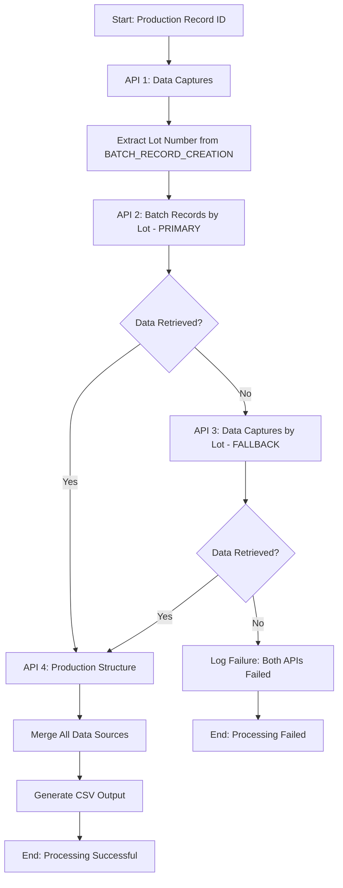

# MasterControl API Data Extraction Pipeline

A comprehensive Python-based data extraction and processing pipeline for MasterControl manufacturing execution systems. This project provides both bulk historical data extraction and incremental real-time data processing capabilities with intelligent API fallback mechanisms and robust error handling.

## 🏗️ Architecture Overview

The system is built with a modular architecture designed for scalability, reliability, and maintainability:

```
┌─────────────────┐    ┌─────────────────┐    ┌─────────────────┐
│   MasterControl │    │   API Client    │    │ Data Processor  │
│      APIs       │◄──►│   (Retry Logic) │◄──►│   (Transform)   │
└─────────────────┘    └─────────────────┘    └─────────────────┘
                                │                        │
                                ▼                        ▼
┌─────────────────┐    ┌─────────────────┐    ┌─────────────────┐
│ Error Handling  │    │  Checkpoint     │    │ Status Tracking │
│ & Alerting      │    │  Management     │    │ & CSV Output    │
└─────────────────┘    └─────────────────┘    └─────────────────┘
```

## 📊 Data Flow Architecture & API Strategy

### **The Four-API Integration Strategy**

The system uses a sophisticated multi-API approach with intelligent fallback mechanisms to ensure data completeness and reliability:

### 1. **Primary Data Capture API** (`/production-record-data-captures`)
**🎯 Purpose**: Main source for detailed manufacturing execution data  
**🔄 Usage**: Retrieved for every production record to get granular process data  
**📊 Data Provided**:  
- All process steps and user interactions
- Timestamps of manufacturing activities
- Data values captured during production
- User actions and system events

### 2. **Batch Records API** (`/batch-records/production-records-list`) - PRIMARY METADATA SOURCE
**🎯 Purpose**: Primary source for batch-level metadata and status information  
**🔄 Usage**: Called using the lot number extracted from the data capture API  
**📊 Data Provided**:  
- Lot number validation and confirmation
- Product identification (Product ID, Product Name)
- Current production status
- Master template information

### 3. **Data Captures by Lot API** (`/data-captures`) - FALLBACK METADATA SOURCE
**🎯 Purpose**: **Alternative endpoint for batch metadata when primary fails**  
**🔄 Usage**: **FALLBACK MECHANISM** - Only called when Batch Records API returns empty results  
**📊 Data Provided** (Same as primary, but from different endpoint):  
- Master template name (mapped to product name)
- Production record status
- Product ID and lot number confirmation

**💡 Why This Fallback Exists:**
```python
# From data_processor.py - The fallback logic
filtered_data_capture_df = self.data_processor.fetch_batch_records_by_lot(lot_number)

# If primary API fails, use fallback
if filtered_data_capture_df.shape[0] == 0:
    filtered_data_capture_df = self.data_processor.fetch_data_capture_by_lot(lot_number)
    if filtered_data_capture_df.shape[0] == 0:
        # Both APIs failed - log failure
        self.status_tracker.log_status(production_record_id, lot_number, "Fail", "Both API calls returned empty")
```

**Real-world scenarios where fallback is needed:**
- Primary API endpoint experiencing temporary issues
- Different data availability windows between APIs
- Varying data consistency across MasterControl modules
- Network or authentication issues specific to one endpoint

### 4. **Production Structure API** (`/production-records/{id}/structures`)
**🎯 Purpose**: Provides hierarchical manufacturing context and process structure  
**🔄 Usage**: Called once per production record to get organizational structure  
**📊 Data Provided**:  
- Unit Procedure hierarchy
- Operation-level details
- Phase-specific information
- Structural relationships (Unit → Operation → Phase)

## 🗂️ Output CSV Field Mapping - Which API Provides What

### **Complete Field-to-API Mapping**

| CSV Field | Source API | API Field | Processing Logic |
|-----------|------------|-----------|------------------|
| **Master Template Name** | Batch Records API (Primary)<br/>Data Captures by Lot API (Fallback) | `productName`<br/>`masterTemplateName` | Direct mapping, fallback uses different field name |
| **Lot Number** | Batch Records API (Primary)<br/>Data Captures by Lot API (Fallback) | `lotNumber` | Extracted from BATCH_RECORD_CREATION records initially |
| **Product ID** | Batch Records API (Primary)<br/>Data Captures by Lot API (Fallback) | `productId` | Direct mapping from metadata APIs |
| **Unit** | Production Structure API | `title` (where level='UNIT_PROCEDURE') | Extracted from hierarchical structure data |
| **Operation** | Production Structure API | `title` (where level='OPERATION') | Filtered by operation level in structure |
| **Phase** | Production Structure API | `title` (where level='PHASE') | Filtered by phase level in structure |
| **Data Capture Time** | Data Captures API | `dateTime` | Converted from UTC to Eastern Time with custom formatting |
| **Production Record Status** | Batch Records API (Primary)<br/>Data Captures by Lot API (Fallback) | `status`<br/>`productionRecordStatus` | Direct mapping, fallback uses different field name |
| **Structure Label** | Data Captures API | `orderLabel` | Enhanced with iteration numbers if available |
| **Description** | Data Captures API | `title` | Direct mapping from capture records |
| **Input Data Value** | Data Captures API | `value` | Raw data values captured during production |
| **Performed By** | Data Captures API | `userName` | User who performed the action (VOD_ users filtered out) |
| **Action Performed** | Data Captures API | `actionTaken` | Type of action performed by user |
| **Captured Data Type** | Data Captures API | `dataCaptureName` | Category/type of data being captured |

### **API Call Sequence & Dependencies**



## 🔄 Process Flow Details

### **Bulk Extraction Mode** (`bulk_fetch.py`)
Designed for historical data extraction with fault tolerance:

1. **Initialization Phase**
   - Load checkpoint from previous runs (`checkpoint_manager.py`)
   - Set up comprehensive logging system
   - Validate configuration parameters and API credentials

2. **Batch Processing Loop**
   - Process production records in configurable batches (default: 100)
   - Implement checkpoint saving after each batch for resume capability
   - Enable fault-tolerant processing with detailed error tracking

3. **Individual Record Processing**
   ```python
   def process_record(self, production_record_id):
       # Step 1: Get detailed process data
       lot_number, filtered_record_data_df = self.data_processor.fetch_production_record_data(production_record_id)
       
       # Step 2: Get batch metadata (with fallback)
       filtered_data_capture_df = self.data_processor.fetch_batch_records_by_lot(lot_number)
       if filtered_data_capture_df.shape[0] == 0:
           # Fallback mechanism
           filtered_data_capture_df = self.data_processor.fetch_data_capture_by_lot(lot_number)
       
       # Step 3: Get structural hierarchy
       unit_df, operation_df, phase_df = self.data_processor.fetch_production_structure_metadata(production_record_id)
       
       # Step 4: Merge and output
       merged_df = self._merge_data(filtered_record_data_df, filtered_data_capture_df, unit_df, operation_df, phase_df)
   ```

4. **Output Generation**
   - Generate individual CSV files per lot number
   - Apply comprehensive data cleaning and formatting
   - Convert UTC timestamps to Eastern Time format
   - Filter out system users (VOD_ prefix)

### **Incremental Processing Mode** (`incremental_fetch.py`)
Real-time processing with time-window management:

1. **Time Window Management**
   - Generate 6-hour processing windows for optimal data freshness
   - Implement 6-hour lag to ensure data completeness in MasterControl
   - Track processed windows in CSV log to prevent duplicates

2. **Production Record Discovery**
   - Query Data Captures API for records modified within time window
   - Extract unique production record IDs to avoid duplicates
   - Store IDs in audit trail for traceability

3. **Stream Processing**
   - Process discovered records using same logic as bulk mode
   - Apply identical four-API integration strategy
   - Generate individual lot-based CSV outputs

## 🛠️ Core Components

### **API Client** (`api_client.py`)
Enterprise-grade HTTP client with comprehensive error handling:

**Features:**
- **Retry Logic**: Configurable retry attempts (default: 3) with exponential backoff
- **Pagination Support**: Automatic handling of MasterControl's paginated responses
- **Error Handling**: Comprehensive exception handling with detailed logging
- **Alert Integration**: Automatic email alerts for API failures
- **Timeout Management**: 10-second timeout with proper error handling

**Key Methods:**
```python
def perform_get_request(self, url, retries=3, delay=0.2):
    # Handles individual API calls with retry logic
    
def fetch_paginated_data(self, base_url, params=None):
    # Automatically handles pagination across all APIs
```

### **Data Processor** (`data_processor.py`)
Core data transformation engine with business logic:

**Key Capabilities:**
- **Schema Validation**: Ensures required columns exist across all APIs
- **Data Normalization**: Handles nested JSON structures from MasterControl
- **Business Logic**: Implements iteration number formatting and data relationships
- **Fallback Management**: Orchestrates the primary/fallback API strategy
- **Data Quality**: Filters current records and validates data integrity

**Critical Methods:**
```python
def fetch_production_record_data(self, production_record_id):
    # Main data capture API - gets detailed process data
    
def fetch_batch_records_by_lot(self, lot_number):
    # Primary metadata API - gets batch information
    
def fetch_data_capture_by_lot(self, lot_number):
    # Fallback metadata API - alternative source for batch data
    
def fetch_production_structure_metadata(self, production_record_id):
    # Structure API - gets hierarchical organization
```

### **Status Tracker** (`status_tracker.py`)
Comprehensive processing state management:

- **Success Tracking**: Records successfully processed production records
- **Failure Logging**: Captures detailed error information with reasons
- **Duplicate Prevention**: Avoids reprocessing successful records
- **Audit Trail**: Maintains complete processing history in CSV format

### **Checkpoint Manager** (`checkpoint_manager.py`)
Fault-tolerant processing state persistence:

- **Progress Persistence**: Saves last successfully processed ID
- **Resume Capability**: Enables restart from exact last checkpoint
- **Timestamp Tracking**: Records processing timestamps for audit
- **Error Recovery**: Handles corrupted checkpoint files gracefully

### **Utility Functions** (`utils.py`)
Support functions for data transformation and alerting:

- **DateTime Conversion**: UTC to Eastern Time with custom formatting
- **Email Alerting**: Sophisticated error notification system
- **Data Validation**: Column existence checking and data quality

## 📧 Error Handling & Alerting System

### **Multi-Level Error Detection**
1. **API-Level Errors**: HTTP failures, timeouts, authentication issues
2. **Data-Level Errors**: Empty responses, missing fields, parsing failures
3. **Process-Level Errors**: Merging issues, file system problems
4. **System-Level Errors**: Network connectivity, resource constraints

### **Intelligent Alerting** (`utils.py`)
**Professional Email Alert System:**
```python
def send_api_failure_alert(url, retries, error_details=None, response_code=None, 
                          response_text=None, duration=None):
```

**Alert Features:**
- **Severity Classification**: 🔴 CRITICAL vs 🟡 WARNING based on error type
- **Detailed Diagnostics**: HTTP status, response times, error messages
- **Structured Format**: Professional email templates with unique incident IDs
- **Actionable Intelligence**: Specific troubleshooting steps and escalation paths
- **Rich Context**: Request duration, response snippets, retry attempts

## 🚀 Getting Started

### **Prerequisites**
```bash
pip install pandas numpy requests python-dateutil pytz python-dotenv
```

### **Environment Configuration**
Create a `.env` file with the following variables:

```env
# API Configuration
API_TOKEN=your_mastercontrol_api_token
API_COOKIE=your_session_cookie
BASE_URL=https://your-mastercontrol-instance.com/api

# Email Alerting Configuration
EMAIL_HOST=smtp.your-domain.com
EMAIL_PORT=465
EMAIL_ADDRESS=alerts@your-domain.com
EMAIL_PASSWORD=your_email_password
EMAIL_RECIPIENTS=admin@your-domain.com,ops@your-domain.com

# File System Paths
OUTPUT_DATA_DIR=../data/raw_bulk_data/
INCR_OUTPUT_DATA_DIR=../data/new_data/
CHECKPOINT_FILE_PATH=../checkpoint.json
PROCESS_STATUS_LOG_PATH=../pipeline_status_log.csv
LOG_FILE_PATH=../bulk_extraction_log.log
INCR_LOG_FILE_PATH=../incr_extraction_log.log
RECORD_IDS_FILE_PATH=../data/record_ids/

# Processing Parameters
DEFAULT_END_ID=60000
DEFAULT_BATCH_SIZE=100
```

### **Running the Pipeline**

**Bulk Historical Extraction:**
```bash
# Start from beginning with custom range
python bulk_fetch.py --start 1 --end 1000 --batch_size 50

# Resume from last checkpoint
python bulk_fetch.py --end 5000

# Use default settings (starts from checkpoint)
python bulk_fetch.py
```

**Incremental Processing:**
```bash
# Manual execution (processes next 6-hour window)
python incremental_fetch.py

# Automated execution via cron (recommended)
# Add to crontab for every 6 hours
0 */6 * * * /path/to/python /path/to/incremental_fetch.py
```

**Testing Email Alerts:**
```bash
# Test email configuration
python test.py
```

## 📁 Output Data Structure

### **Standardized CSV Schema**
Each lot generates a CSV file with the following comprehensive schema:

| Column | Description | Source API | Example Value |
|--------|-------------|------------|---------------|
| **Master Template Name** | Product manufacturing template | Batch Records (Primary) / Data Captures by Lot (Fallback) | "API Manufacturing Template v2.1" |
| **Lot Number** | Unique batch identifier | Extracted from Data Captures → Batch Records/Fallback | "LOT-2024-001-A" |
| **Product ID** | Product identifier | Batch Records (Primary) / Data Captures by Lot (Fallback) | "PROD-API-12345" |
| **Unit** | Manufacturing unit procedure | Production Structure API | "Mixing Unit 1" |
| **Operation** | Specific manufacturing operation | Production Structure API | "Blend Operation" |
| **Phase** | Detailed process phase | Production Structure API | "High-Speed Mixing Phase" |
| **Data Capture Time** | Action timestamp (Eastern Time) | Data Captures API | "3/15/2024 14:30" |
| **Production Record Status** | Current production status | Batch Records (Primary) / Data Captures by Lot (Fallback) | "In Progress" |
| **Structure Label** | Process step label with iterations | Data Captures API | "Add Material A - 2" |
| **Description** | Detailed action description | Data Captures API | "Add 25.5kg of Material A" |
| **Input Data Value** | Captured measurement/value | Data Captures API | "25.5" |
| **Performed By** | User who performed action | Data Captures API | "operator1" |
| **Action Performed** | Type of user action | Data Captures API | "Manual Data Entry" |
| **Captured Data Type** | Category of captured data | Data Captures API | "MATERIAL_ADDITION" |

### **Directory Structure**
```
project_root/
├── data/
│   ├── raw_bulk_data/           # Bulk extraction outputs
│   │   ├── LOT-2024-001.csv     # Individual lot files
│   │   ├── LOT-2024-002.csv
│   │   └── ...
│   ├── new_data/               # Incremental processing outputs
│   │   ├── LOT-2024-NEW-001.csv
│   │   └── ...
│   └── record_ids/             # Processing audit trails
│       ├── 2024-01-01_00_00_00_2024-01-01_06_00_00.csv
│       └── ...
├── logs/
│   ├── bulk_extraction_log.log
│   ├── incr_extraction_log.log
│   └── pipeline_status_log.csv
├── checkpoint.json             # Processing state
├── six_hour_windows.csv       # Incremental processing windows
└── pipeline_status_log.csv    # Success/failure tracking
```

## 🔍 Monitoring & Maintenance

### **Key Performance Indicators**
- **Processing Rate**: Records processed per hour
- **Success Rate**: Percentage of successful extractions
- **API Health**: Response times and error rates across all four APIs
- **Fallback Usage**: How often the fallback API is used
- **Data Quality**: Completeness and validation metrics

### **Log Analysis**
```bash
# Monitor processing progress
tail -f bulk_extraction_log.log

# Check API failure patterns
grep "Request failed" bulk_extraction_log.log

# Review successful processing
grep "Successfully processed" bulk_extraction_log.log

# Analyze fallback API usage
grep "Both API calls returned empty" bulk_extraction_log.log
```

### **Maintenance Checklist**
- [ ] Regular log rotation and archival
- [ ] Checkpoint file backup and recovery testing
- [ ] API credential rotation and testing
- [ ] Performance monitoring and optimization
- [ ] Email alert system testing
- [ ] Data quality validation
- [ ] Fallback API health monitoring

## 🤝 Contributing

1. Fork the repository
2. Create a feature branch (`git checkout -b feature/amazing-feature`)
3. Commit your changes (`git commit -m 'Add amazing feature'`)
4. Push to the branch (`git push origin feature/amazing-feature`)
5. Open a Pull Request

## 📝 License

This project is licensed under the MIT License - see the LICENSE file for details.

## 🆘 Troubleshooting

### **Common Issues & Solutions**

**Issue**: "Both API calls returned empty"
- **Cause**: Primary and fallback APIs both failed for a lot number
- **Solution**: Check lot number validity and API connectivity

**Issue**: Email alerts not working
- **Cause**: SMTP configuration issues
- **Solution**: Test with `python test.py` and verify email settings

**Issue**: Processing stuck at checkpoint
- **Cause**: Corrupted checkpoint file
- **Solution**: Delete `checkpoint.json` and restart with `--start` parameter

**Issue**: Missing structure data (Unit/Operation/Phase empty)
- **Cause**: Production Structure API failure
- **Solution**: Check API permissions and production record validity

### **Support Contacts**
For issues and questions:
- Check the comprehensive logs for detailed error messages
- Review the status tracking CSV for processing history
- Verify API connectivity and authentication
- Test individual API endpoints manually
- Contact the development team with specific error details and log excerpts

## 📈 Future Enhancements

- **Real-time Streaming**: WebSocket integration for live data processing
- **Advanced Data Validation**: Enhanced schema validation and data quality checks
- **Performance Optimization**: Parallel processing and connection pooling
- **Monitoring Dashboard**: Real-time processing metrics and alerting UI
- **Data Warehouse Integration**: Direct database loading capabilities
- **API Health Dashboard**: Monitor all four APIs with health metrics
- **Predictive Failure Detection**: Machine learning for proactive error prevention
